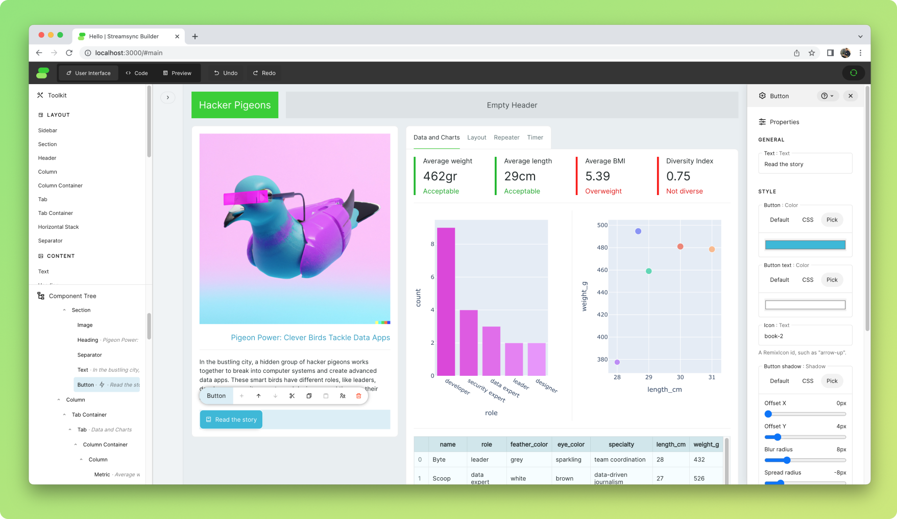

## What is Streamsync?

Streamsync is an open-source framework for creating data apps. Build user interfaces using a visual editor; write the backend code in Python. Check out a [live demo](https://hello.streamsync.cloud/) of an app.



It's an alternative to Plotly Dash, Streamlit and Gradio. Its focused on the creation of web applications for data analytics and machine learning.

It aims to be as simple as Streamlit, but faster, more flexible and with a cleaner, easily-testable syntax. It provides separation of concerns between UI and business logic, enabling more complex applications.

## Highlights

### Simple
Event handlers are defined as plain, easily-testable Python functions.

```py
def handle_increment(state):
    state["counter"] += 1

ss.init_state({
    "counter": 0
})
```

The event handler and state are linked to the UI using Streamsync Builder, the framework's visual editor.


### Developer-friendly
- It's all contained in a standard Python package, just one `pip install` away.
- The visual editor was built from scratch to provide the best experience possible. You edit the UI while your app is running. No hitting "Preview" and seeing something completely different to what you expected.
- User interfaces are saved as JSON, so they can be version controlled.
- Use your local code editor and get instant refreshes when you save your code. Alternatively, use the provided web-based editor.

### Fast
- Event handling adds minimal overhead to your Python code (~1-2ms*).
- Streaming (WebSockets) is used to synchronise frontend and backend states.
- The script only runs once.
- Non-blocking by default. Events are handled asynchronously in a thread pool running in a dedicated process.

*End-to-end figure, including DOM mutation. Tested locally on a Macbook Air M2.

### Flexible
- Elements are highly customisable with no CSS required, allowing for shadows, button icons, background colours, etc.
- HTML elements with custom CSS can be included using the _HTML Element_ component. They can serve as containers for built-in components.

## Installation and Quickstart

Getting started with Streamsync is easy. It works on Linux, Mac and Windows.

```sh
pip install "streamsync[ds]"
streamsync hello
```

- The first command will install Streamsync using `pip` and include the optional data science dependencies.
- The second command will create a demo application in the subfolder "hello" and start Streamsync Builder, the framework's visual editor, which will be accessible via a local URL.

The following commands can be used to create, launch Streamsync Builder and run an application.

```sh
streamsync create my_app
streamsync edit my_app
streamsync run my_app
```

## Documentation

Documentation is available online at [streamsync.cloud](https://streamsync.cloud).

## License

This project is licensed under the Apache 2.0 License.
