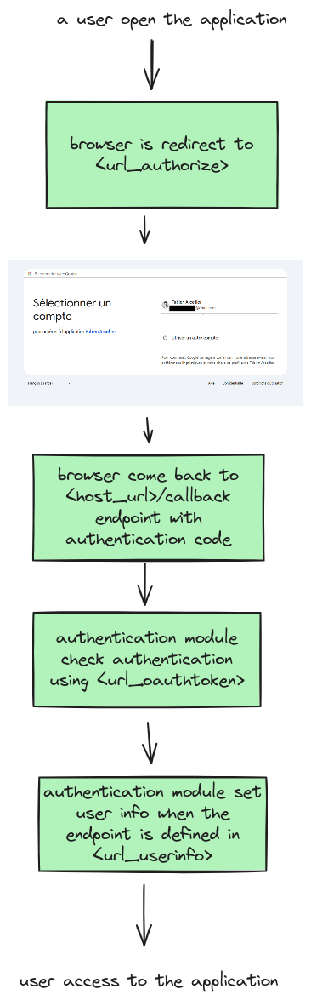

# Authentication

The StreamSync authentication module allows you to restrict access to your application.

Streamsync will be able to authenticate a user through an identity provider such as Google, Microsoft, Facebook, Github, Auth0, etc.

::: warning Authentication is done before accessing the application
Authentication is done before accessing the application. It is not possible to trigger authentication for certain pages exclusively.
:::

## Use OIDC provider

Authentication configuration is done in [the `server_setup.py` module](custom-server.md). The configuration depends on your identity provider. 
Here is an example configuration for Google.


*server_setup.py*
```python
import os
import streamsync.serve
import streamsync.auth

oidc = streamsync.auth.Oidc(
    client_id="1xxxxxxxxx-qxxxxxxxxxxxxxxx.apps.googleusercontent.com",
    client_secret="GOxxxx-xxxxxxxxxxxxxxxxxxxxx",
    host_url=os.getenv('HOST_URL', "http://localhost:5000"),
    url_authorize="https://accounts.google.com/o/oauth2/auth",
    url_oauthtoken="https://oauth2.googleapis.com/token",
    url_userinfo='https://www.googleapis.com/oauth2/v1/userinfo?alt=json'
)

streamsync.serve.register_auth(oidc)
```
### Use pre-configured OIDC

StreamSync provides pre-configured OIDC providers. You can use them directly in your application.

|                                                                                    | Provider                                                                                | Function | Description                                                                                     |
|------------------------------------------------------------------------------------|-----------------------------------------------------------------------------------------|----------|-------------------------------------------------------------------------------------------------|
|     | Google  | `streamsync.auth.Google` | Allow your users to login with their Google Account                                             |
|     | Github                                                                                  | `streamsync.auth.Github` | Allow your users to login with their Github Account                                             |
|      | Auth0                                                                                   | `streamsync.auth.Auth0` | Allow your users to login with different providers or with login password through Auth0 |


#### Google

You have to register your application into [Google Cloud Console](https://console.cloud.google.com/).

*server_setup.py*
```python
import os
import streamsync.serve
import streamsync.auth

oidc = streamsync.auth.Google(
	client_id="1xxxxxxxxx-qxxxxxxxxxxxxxxx.apps.googleusercontent.com",
	client_secret="GOxxxx-xxxxxxxxxxxxxxxxxxxxx",
	host_url=os.getenv('HOST_URL', "http://localhost:5000")
)

streamsync.serve.register_auth(oidc)
```

#### Github

You have to register your application into [Github](https://docs.github.com/en/apps/creating-github-apps/registering-a-github-app/registering-a-github-app#registering-a-github-app)

*server_setup.py*
```python
import os
import streamsync.serve
import streamsync.auth

oidc = streamsync.auth.Github(
	client_id="xxxxxxx",
	client_secret="xxxxxxxxxxxxx",
	host_url=os.getenv('HOST_URL', "http://localhost:5000")
)

streamsync.serve.register_auth(oidc)
```

#### Auth0

You have to register your application into [Auth0](https://auth0.com/).

*server_setup.py*
```python
import os
import streamsync.serve
import streamsync.auth

oidc = streamsync.auth.Auth0(
	client_id="xxxxxxx",
	client_secret="xxxxxxxxxxxxx",
	domain="xxx-xxxxx.eu.auth0.com",
	host_url=os.getenv('HOST_URL', "http://localhost:5000")
)

streamsync.serve.register_auth(oidc)
```

### Authentication workflow



## User information in event handler

When the `user_info` route is configured, user information will be accessible 
in the event handler through the `session` argument.

```python
def on_page_load(state, session):
    email = session['userinfo'].get('email', None)
    state['email'] = email
```


## Unauthorize access

It is possible to reject a user who, for example, does not have the correct email address.

::: tip you can also use userinfo inside app
You can restrict access to certain pages inside the application by using the `session` object.
See [User information in event handler](#user-information-in-event-handler)
:::

```python
from fastapi import Request

import streamsync.serve
import streamsync.auth

oidc = ...

def callback(request: Request, session_id: str, userinfo: dict):
    if userinfo['email'] not in ['nom.prenom123@example.com']:
        raise streamsync.auth.Unauthorized(more_info="You can contact the administrator at <a href='https://support.example.com'>support.example.com</a>")

streamsync.serve.register_auth(oidc, callback=callback)
```

The default authentication error page look like this:


*streamsync.auth.Unauthorized*

| Parameter | Description |
|-----------|-------------|
| status_code | HTTP status code |
| message | Error message |
| more_info | Additional information |

## Modify user info

User info can be modified in the callback.

```python
from fastapi import Request

import streamsync.serve
import streamsync.auth

oidc = ...

def callback(request: Request, session_id: str, userinfo: dict):
	userinfo['group'] = []
	if userinfo['email'] in ['fabien@example.com']:
		userinfo['group'].append('admin')
		userinfo['group'].append('user')
	else:
		userinfo['group'].append('user')
	
streamsync.serve.register_auth(oidc, callback=callback)
```
from fastapi import Request

## Custom unauthorized page

You can customize the access denial page using your own template.

```python
import os

from fastapi import Request, Response
from fastapi.templating import Jinja2Templates

import streamsync.serve
import streamsync.auth

oidc = ...

def unauthorized(request: Request, exc: streamsync.auth.Unauthorized) -> Response:
    templates = Jinja2Templates(directory=os.path.join(os.path.dirname(__file__), "templates"))
    return templates.TemplateResponse(request=request, name="unauthorized.html", status_code=exc.status_code, context={
        "status_code": exc.status_code,
        "message": exc.message,
        "more_info": exc.more_info
    })

streamsync.serve.register_auth(oidc, unauthorized_action=unauthorized)
```

## Enable in edit mode

Authentication is disabled in edit mode. To activate it, 
you must trigger the loading of the server_setup module in edition mode.

```bash
streamsync edit --enable-server-setup
```

