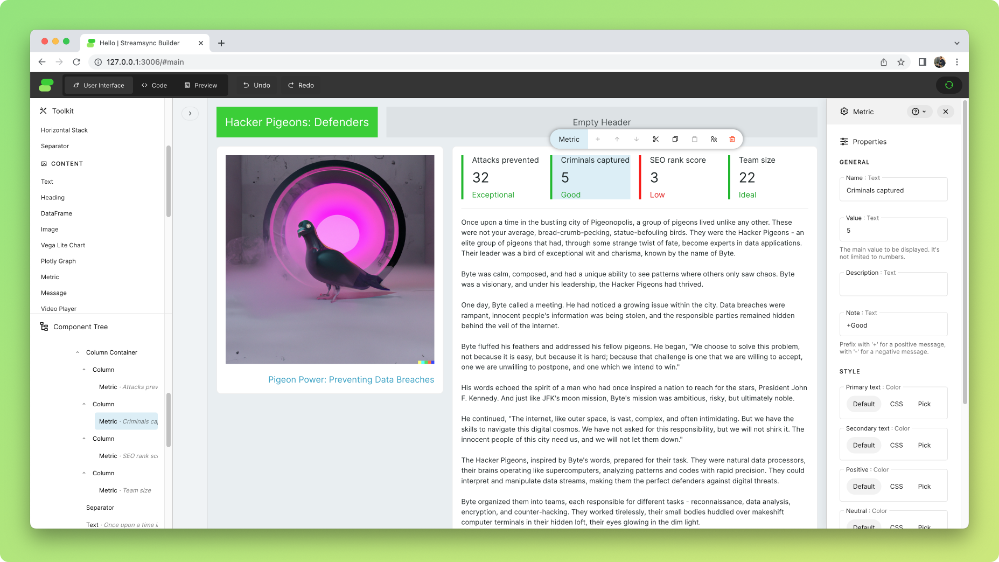
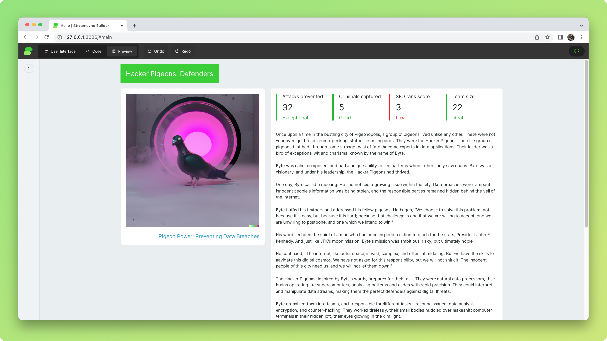

# Builder basics

Streamsync Builder works as an overlay of the running app; you edit your app while it's running. It gives you an accurate representation of what the app will look like and how it'll behave, without the need to constantly preview it. Changes to the user interface are automatically saved to `ui.json`.

## Modes

You can switch modes between _User Interface_, _Code_ and _Preview_ using the buttons on the top bar.

### User Interface

The default mode. Allows you to focus on building the interface.

### Code

This mode displays the code editor and the application log, while still allowing you to access the _Component Tree_ and _Settings_.

#### Code editor

The built-in code editor for `main.py`, the entry point of your application. This editor is provided for convenience and is ideal for quick edits —but you don't need to rely on it.

If you need a more powerful editor or if your codebase is distributed across several files, use a local editor.

::: tip Code changes are automatically detected

The application will reload whenever a change to a `.py` file inside the app folder is detected. This feature only works in Streamsync Builder i.e. `edit` mode, not when running the app in `run` mode.

:::

#### Application log

Exceptions raised by your application are shown here, as log entries. Standard output from your application is also captured and displayed as log entries.

### Preview

The _Preview_ mode shows the application exactly like the user will see it. It allocates the whole width of the viewport to the app.

## Adding and moving components

- Drag and drop components from the _Toolkit_ to the app to create new components.
- Some components can be parents, e.g. _Section_. Others can't, e.g. _Text_.
- Certain components have restrictions. For example, a _Column_ can only be added to a _Column Container_. A _Sidebar_ can only be added to a _Page_.
- By default, components are added in the last position. To add components in a specific position, drag over the desired parent until the insertion lines are shown.

- You can drag and drop existing components within the app, from one parent to another, or within the same parent to reposition them.
- Alternatively, you can use the _Component Tree_ either as source or destination for drag and drop.

## Selecting a component

- Select a component by clicking on it. If you click on a component that's already selected, the click will be treated as an interaction with the app.
- Two things will happen when a component is selected.
  1. The _Component Settings_ panel will open on the right. Depending on available screen real estate, the panel will open on top of the app or next to it.
  2. A set of component-specific actions, _Component Shortcuts_, will be displayed on top of the component.

## Component settings

Settings are divided into the following sections. Changes to settings can be undone and redone using the buttons on the top bar.

### Properties

Divided into _General_ and _Style_ categories. Values can include

- Literals, e.g. `monkey`
- References to application state using the template syntax `@{}`, e.g. `@{my_favourite_animal}`.
- A combination of both, e.g. `My favourite animal is @{my_favourite_animal}`.
- Nested states can be accessed with `.` (dot), e.g. `@{building.height}`.
- Nested elements can be dynamically accessed with `[]`, e.g. `@{building[dynamic_prop]}` will be equivalent to `@{building.height}` when `dynamic_prop` equals `height`.

Properties are of different types, such as _Text_, _Color_ and _Number_. All property values are stored as text values, then casted when being evaluated.

### Binding

Input components can be bound, in a two-way fashion, to a state element.

For example, a _Slider Input_ component can be bound to `my_var`. If the value of the slider changes, so does the value of `my_var`. Similarly, if the value of `my_var` changes, the slider is moved automatically to reflect the change.

To bind an input component, specify the state element. For example, `my_var` or `building.height`. Note that this field should not contain the template syntax, e.g. `my_var` and not `@{my_var}`.

### Events

The events generated by this component, with the option of setting event handlers for those. Event handlers are explained in more detail in a separate section of this guide.

### Visibility

Whether the component should be displayed. There are three visibility options:

- Yes. The component is displayed.
- No. The component isn't displayed. Note that hidden components are still part of the HTML code, but aren't shown.
- Custom. Whether the component is displayed or not depends on the value of a state or context element. For example if set to `my_var`, visibility will depend on the value of the `my_var` state element. Note that this field, similarly to Binding, should only contain the state element, e.g. `my_var` and not `@{my_var}`.

## Component shortcuts

Perform a variety of operations on existing components. Options will be grayed out when they're not applicable to the relevant component. Most shortcuts can be triggered using the keyboard; hover on them to show the appropriate combination.

- _Add_. Adds a child of a given type to this component.
- _Move up_. Decrements the position index of the component, used to sort children in the parent container.
- _Move down_. Increments the position index of the component.
- _Cut_. Cuts the component and places it into Builder's internal clipboard.
- _Copy_. Copies the component and places it into the internal clipboard.
- _Paste_. Pastes the content of the internal clipboard using the selected component as a parent.
- _Go to parent_. Selects the parent of the selected component.
- _Delete_. Deletes this component.

Just like with changes to settings, these operations can be undone and redone.

## Discovering components

Builder is designed to allow easy discoverability of components. Rather than scouring specifications every time you need to use a component, you can rely on the visual editor to guide you.

### Short description

You can hover on the component type to get a tooltip with a short description.

### Available properties and events

Looking at _Settings_ will allow you to see which of its properties are configurable.

### Built-in docs

Components have short docs built into them. You can expand it by clicking the help icon in Settings.

### Event handler stub code

Different events need to be handled differently. The built-in stub handlers, which can be found next to each event, can help you get started when writing event handlers.
