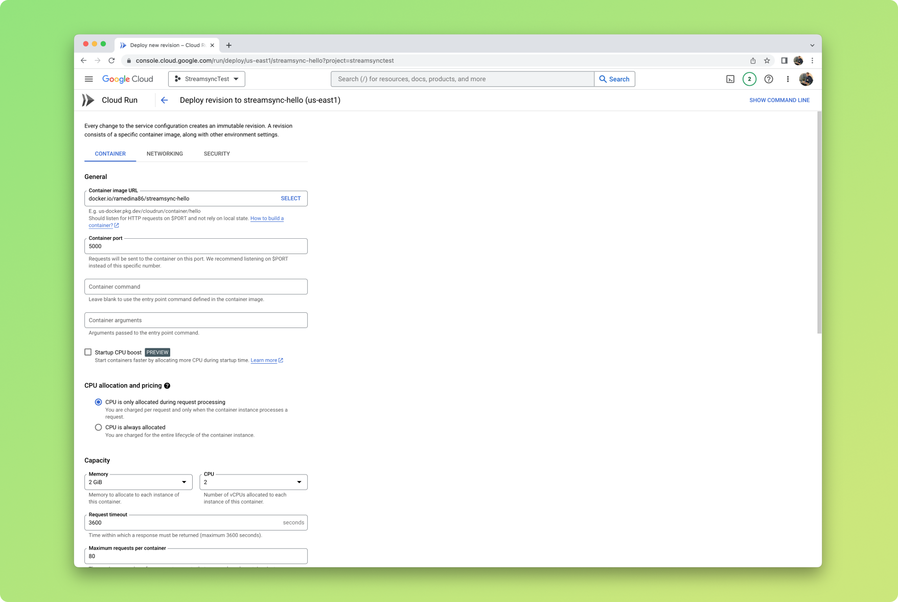

# Deploy with Docker

You can use Docker to deploy Writer anywhere. If you're an experienced Docker user, you may want to go straight to the provided Dockerfile.

## Creating a Docker image

### Setting up

- Make sure you have Docker installed.
- Open a terminal and navigate to your app's folder.
- Create a `pyproject.toml` using `poetry init` and install `writer` using `poetry add writer`

### What is Poetry and Its Purpose?

Poetry is a tool for dependency management and packaging in Python. It aims to bring the best of all packaging worlds (bundling, distributing, and dependency management) to the Python world. Poetry helps to create and manage projects with a consistent and reproducible environment. Here are some key features and purposes of Poetry:

1. **Dependency Management**: Poetry manages your project’s dependencies, ensuring that you and anyone else working on your project have the same packages installed, which helps avoid the common "it works on my machine" problem.

2. **Project Configuration**: It uses a simple `pyproject.toml` file to specify project details such as name, version, dependencies, and more, making the configuration clean and straightforward.

3. **Virtual Environment Management**: Poetry can create and manage virtual environments automatically. This isolates project dependencies from the global Python environment, preventing conflicts between different projects.

4. **Publishing Packages**: It simplifies the process of publishing your project to the Python Package Index (PyPI) or other repositories, helping you share your work with the community easily.

5. **Reproducible Builds**: By locking dependencies to specific versions, Poetry ensures that builds are reproducible, which means the same dependencies are installed each time, preventing unexpected changes in behavior due to updates.

### Using and Setting Up Poetry

Poetry is a dependency management tool for Python that helps you declare, manage, and install dependencies. Here’s how you can set it up for your project:

1. **Install Poetry**: If you don't have Poetry installed, you can install it using the following command:
   ```sh
   curl -sSL https://install.python-poetry.org | python3 -
   ```
   Alternatively, you can use the following command if you prefer to use pip:
   ```sh
   pip install poetry
   ```

2. **Initialize Your Project**: Navigate to your project directory and initialize a new Poetry project.
   ```sh
   poetry init
   ```
   Follow the prompts to set up your `pyproject.toml` file. This file will include metadata about your project and its dependencies.

3. **Add Dependencies**: Use Poetry to add `writer` and any other dependencies your project needs.
   ```sh
   poetry add writer 
   ```
   This command will update your `pyproject.toml` file with `writer` as a dependency and install it.

4. **Install Dependencies**: Ensure all dependencies are installed in your virtual environment.
   ```sh
   poetry install
   ```
   This will create a virtual environment (if it doesn't already exist) and install all dependencies listed in `pyproject.toml`.

### What is Docker and Why Use It?

Docker is a platform that enables developers to create, deploy, and run applications in containers. Containers are lightweight, portable, and ensure consistency across multiple environments. Here’s why Docker is useful:

1. **Consistency**: Docker ensures that your application runs the same way, regardless of where it is deployed, by packaging everything it needs into a single container.

2. **Isolation**: Containers isolate your application from other applications and the underlying system, preventing conflicts and making it easier to manage dependencies.

3. **Portability**: Docker containers can run on any system that supports Docker, making it easy to move applications between development, testing, and production environments.

4. **Efficiency**: Containers are more lightweight than virtual machines, as they share the host system’s kernel, which makes them start up faster and consume fewer resources.

### Creating a Dockerfile

A Dockerfile is a file with instructions that tell Docker how to build your image. It must be named `Dockerfile`.

You can use the following as-is, or as a starting point. It should be saved in your app's folder, together with `main.py` and `ui.json`.

```docker
# Use an official Python runtime as a parent image
FROM python:3.10-bullseye

# Update the package repository and install required dependencies
RUN apt-get update -y && mkdir /app
RUN apt-get install build-essential cmake python3-dev -y

# Set the working directory in the container to /app
WORKDIR /app

# Copy the current directory contents into the container at /app
COPY . /app

# Install Poetry
RUN pip3 install poetry

# Configure Poetry to not create a virtual environment
RUN poetry config virtualenvs.create false

# Install dependencies specified in pyproject.toml
RUN poetry install --only main

# Make port 8080 available to the world outside this container
EXPOSE 8080

# Define environment variable
ENV NAME StreamsyncApp

# Run Streamsync when the container launches
ENTRYPOINT [ "writer", "run" ]
CMD [ ".",  "--port", "8080", "--host", "0.0.0.0" ]
```

### Building the Docker image

To build the image, you need to run the `docker build` command in your terminal. This command tells Docker to build the image according to the instructions in the Dockerfile. The `-t` option tags the image with a name.

1. **Navigate to your project directory**:
   ```sh
   cd path/to/your/app
   ```

2. **Build the Docker image**:
   ```sh
   docker build . -t my_framework_app
   ```
   In this command:
   - `.` tells Docker to use the current directory as the context for the build.
   - `-t my_framework_app` tags the image with the name `my_framework_app`.

Docker will read the Dockerfile, execute the instructions, and build the image. This process may take a few minutes, especially the first time, as it needs to download the base image and install dependencies.

### Running the Docker Container

Once the image is built, you can run a container based on that image. Use the `docker run` command to start the container.

1. **Run the container**:
   ```sh
   docker run -p 8080:8080 my_framework_app
   ```
   In this command:
   - `-p 8080:8080` maps port 8080 of the host machine to port 8080 of the container, making the app accessible via `http://localhost:8080`.
   - `my_framework_app` is the name of the image to run.

2. **Access the application**:
   Open your web browser and go to [http://localhost:8080](http://localhost:8080) to see your app running.

### Publishing Your Docker Image

Once your Docker image has been built, you can publish it to a registry. A registry is a place where Docker images are stored and made available to other services.

We recommend using Docker Hub; it has a generous free tier, it's very easy to set up, and it's widely supported. However, you can choose to use another service such as Azure Container Registry. To use Docker Hub, you'll need to sign up for an account.

1. **Login to Docker Hub**:
   ```sh
   docker login
   ```

2. **Tag your image**:
   ```sh
   docker tag my_framework_app:latest my_user/my_framework_app:latest
   ```
   Replace `my_user` with your Docker Hub username.

3. **Push your image to Docker Hub**:
   ```sh
   docker push my_user/my_framework_app:latest
   ```

### Deploying Your Docker Image

As mentioned earlier, once the image is in a registry, it can be spun up by others. After trying a few options, we recommend using Google Cloud Run. Its free tier is generous, and SSL works out of the box.

Cloud Run can be configured in just one page. It takes the image from a registry and makes it available via a URL, with SSL enabled by default. We recommend the following settings:

- Minimum 0 instances, maximum 4 instances. Unless your app needs to serve several thousands of users.
- Request timeout to the maximum allowed and _Session Affinity_ enabled. This ensures that WebSockets connections are not unnecessarily dropped.
- 2GB of memory and 2 vCPUs. This will likely be enough to comfortably run a simple app. You can probably get away with much less (512MB of memory and 1vCPU) if your app isn't too demanding and you don't expect much traffic.

Follow the Google Cloud Run documentation to deploy your Docker image and make your app available on the web.


