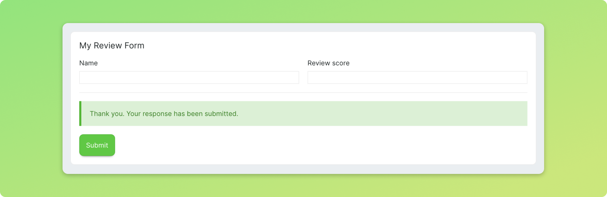

# Handling inputs

There are two, complementary, ways to handle inputs in Streamsync: via event handlers and via binding.

## Event handlers

Input components have _change_ events that are dispatched when the value changes. The new value is provided as a payload in the event handler. Change events have slightly different names across components, reflecting the payloads they provide. For example, _Number Input_ and _Slider Input_ use the event `ss-number-change` while _Text Input_ and _Text Area Input_ use the generic `ss-change`.

As discussed in the [Event handlers](event-handlers.html) section, the payload can be accessed via the `payload` argument in the event handler.

```py
# This event handler takes the payload and assigns it
# to the state element "name"
def handle_input_change(state, payload):
    state["name"] = payload
```

## Two-way bindings

Writing event handlers for every input component can be tedious. In most cases, you'll only need to update a single element of state when the value changes, akin to the example above. You can achieve this by binding a component to a state element.

Bindings automatically handle the _change_ event for the component and set the value of the state element to the payload. Furthermore, bindings are two-way. If the state element is updated from the backend, the frontend component is updated to reflect the new value.

As mentioned in the [Builder basics](builder-basics.html) section of the guide, bindings can be configured in the component settings.


The binding above establishes a two-way link between the component and the state element `name`. If `name` changes in the backend, the component changes. If the component changes, the value of `name` changes.

## Using events and bindings simultaneously

Bindings can be used together with events. This is useful for triggering recalculations or applying dynamic filters. For example, you may want to have three _Number Input_ components bound to `a`, `b` and `c` and display a value `n`. This easily done by binding the components and linking the same recalculation event handler to all three components.

```py
def recalculate(state):
    state["n"] = state["a"]*state["b"]*state["c"]
```

## Handling inputs safely

Streamsync automatically sanitises the payloads it provides for its built-in events, those that start with `ss-`.

For example, if a _Dropdown Input_ component lists options `high` and `low`, you're guaranteed you won't get a value like `"Robert'); DROP TABLE students;--"` when handling `ss-option-change`. You'll get `"high"`, `"low"` or `None`.

::: warning Inputs are sanitised, but you should still be careful

As with any application, it's important to be familiar with the risks associated with handling user input, especially SQL injections. If you're using any custom HTML and mixing it with user generated content, make sure you understand XSS.
:::

## Creating forms

Input components can be combined with _Message_ and _Button_ components to create forms with messages, indicating whether the submission was successful.


