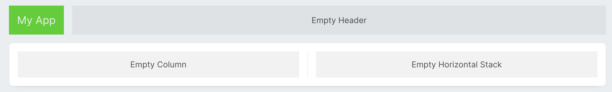
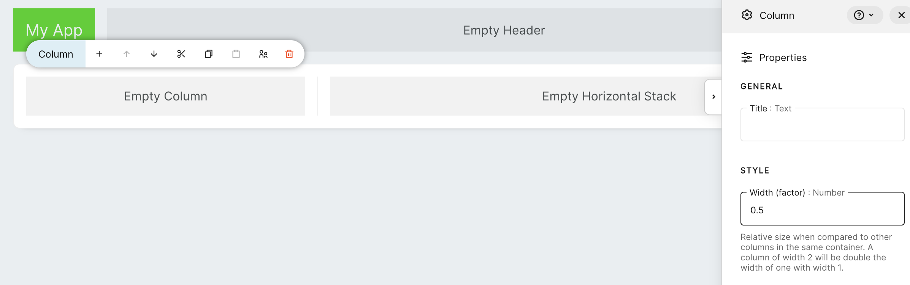
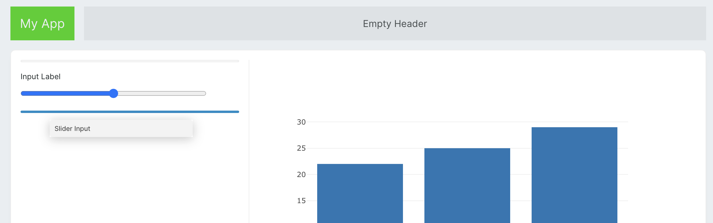
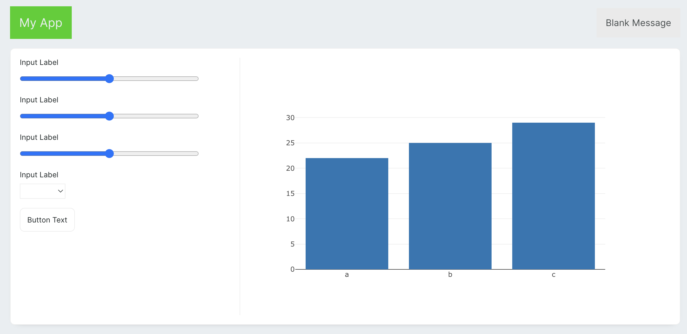
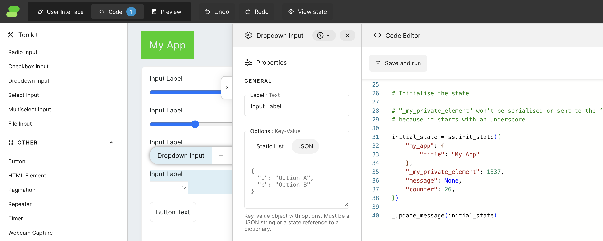

# Quickstart tutorial - Logistic regression visualisation
In this tutorial, we'll guide you through creating a logistic regression visualisation tool using Streamsync. Logistic regression is a fundamental technique in machine learning for binary classification tasks, and visualising its decision boundary can provide valuable insights into the model's behaviour.

First, make sure you have Streamsync installed. You can install it via pip:

```bash
pip install "streamsync[ds]"
```

Now, let's get started with creating our logistic regression visualisation tool. We'll break down the process into the following steps:

1. Setup Project
2. UI Creation
3. App state and bindings
4. Python implementation
5. Troubleshooting

So, without further ado, let's jump into it.

## Project Setup

To create our project, we will use the following commands:

```bash
streamsync create logistic_regression
cd logistic_regression
```
Commands will create basic template of app project with initial file structure.
In this project, we will be using the scikit-learn package for logistic regression, so let's install it before we start.
Create a file `requirements.txt` and add the following line:

```
scikit-learn==1.4.0
```

After that, we can install our requirements.

```bash
pip install -r requirements.txt
```

Once this is done, we can finally run the Streamsync editor using the command:

```bash
streamsync edit .
```

This will run our Streamsync instance. Runtime logs can be observed in the terminal, and the app is available at http://localhost:3006.


## UI Creation

By default, Streamsync creates a simple application with a counter. To keep things easy, let's remove the contents from columns to make space for our new application. If you're unsure where to click to select a specific component on the screen, you can always use the `Component Tree` on the bottom left of the screen. The app should look something like this when you finish.



This app will be made up of 2 columns, one with controls for our plot and the second with the plot itself. Half of the screen is way too much for controls, and the plot will be really small this way. To change the proportions of the columns, change the value of `Width (factor)` in the left column to `0.5`.



This way, it will take just `1/3` of the screen. Proportions are calculated relative to each other. Each _Column_, by default, has the value of this factor set to 1. So, when we set the left column to 0.5 and the right to 1, we will get a relation between column sizes of 1:2.



Now let's add the rest of the components:

- To the right column, add a _Plotly Graph_.
- To the left:
    - 3 x _Slider Input_
    - _Dropdown Input_
    - _Button_.
- To the free space in the header, let's place a _Message_ component.



Now we can configure components with some static settings. You can find all the configuration options in right sidebar. Sidebar will apear after selecting the component using mouse click. Starting with slider inputs, let's set all 3 sliders configuration values to the following values:

|   Property        |   Value (Slider 1)    |   Value (Slider 2)    |   Value (Slider 3)    |
| :-----------:     | :-------------------  | :-------------------  | :-------------------  |
|   Label           |   Number of groups    |   Number of points    |   Cluster deviation   |
|   Minimum value   |   2                   |   50                  |   0                   |
|   Maximum value   |   10                  |   1000                |   10                  |
|   Step size       |   1                   |   1                   |   0.1                 |

Then for the dropdown, we will set:

|   Property        |   Value               |
| :-----------:     | :-------------------  |
|   Label           |   Type                |
|   Options         |   set `JSON` and paste:                   |
|                |   `{"ovr": "One vs Rest", "multinomial": "Multinomial"}`  |


And in the end lets rename the button.

|   Property        |   Value               |
| :-----------:     | :-------------------  |
|   Text            |   Regenerate          |

## App State and Bindings

It is time to create the application's initial state. Let's open the code editor. In this tutorial, we will be using the built-in code editor, which can be found by clicking on the 'Code' button at the top of the screen. However, if you prefer using your favourite editor, you can simply edit the `main.py` file, and the app will auto-refresh every time the file is changed.



Let's remove all code from there and start with:

```python
import streamsync as ss
import plotly.graph_objects as go
from sklearn.linear_model import LogisticRegression
from sklearn.datasets import make_blobs

initial_state = ss.init_state({
    "my_app": {
        "title": "Logistic Regression Visualiser"
    },
    "message": None,
    "figure": None,
    "multi_class": "ovr",
    "number_of_groups": 2,
    "number_of_points": 50,
    "cluster_std": 2,
})
```
For now, only the Streamsync import is needed, but the rest will be used later on. Notice that after pasting this code into the editor, when we click on `Save and run`, the header of our application will immediately change to "Logistic regression visualiser". This is because the Header has in its text property the value `@{my_app.title}`, which is a template syntax that uses a value from the state.

The rest of the keys and values from the `initial_state` are names and initial values for components that will be used for communication between the app UI and the backend. Assigning those keys to components is called binding, and it is done by clicking on each component and filling property "State element" in the "Binding" menu. Let's use these bindings for our 3 _Slider Input_ components:

|   Property        |   Value (Slider 1)    |   Value (Slider 2)    |   Value (Slider 3)    |
| :-----------:     | :-------------------  | :-------------------  | :-------------------  |
|   State element   |  `number_of_groups`   |   `number_of_points`  |   `cluster_std`       |

For the _Dropdown Input_:

|   Property        |   Value               |
| :-----------:     | :-------------------  | 
|   State element   |  `multi_class`        | 

If you closely follow my steps, the massage component can be hidden behind the right bar. Use the `Component Tree` to click the element and open the `Properties` menu.

_Message_ component doesen't have bindings but we still can use template syntax to use data from the state inside of a `Message`. Additionaly we are able to use this data to control the visibility of the component.

|   Property            |   Value               |
| :-----------:         | :-------------------  | 
|   Message             |   `@{message}`        | 
|   Visibility          |   `custom`            |
|   Visibility value    |   `message`           |

This way, the _Message_ component will show only if there is a message to display.

For _Plotly Graph_ we use template syntax again:

|   Property            |   Value               |
| :-----------:         | :-------------------  | 
| Graph specification   |   `@{figure}`         |

Congratulations! You have just connected all components to the application state. Nothing is happening yet. Now, we are ready to make it alive. It's time for python!

## Python implementation

Let's create a function that will update our application based on inputs and call it immediately.

```python
def update(state):
   state["message"] = "Hello, world!"

update(initial_state)
```
Notice that _Message_ showed up, and it is now displaying the message "Hello, World!". To have better access to state parameters and to make it clear on which parameters our function depends, we define them at the top of the function. Notice that some of them need to be mapped to appropriate types. The _Slider Input_ returns float values by default, so here, as we will need integers, we cast values to int.

```python
def update(state):
    cluster_std = state['cluster_std']
    multi_class = state['multi_class']
    number_of_points = int(state['number_of_points'])
    number_of_groups = int(state['number_of_groups'])
```
In this example, we create a logistic regression visualisation, but the algorithm itself is not in the scope of this tutorial. So we will just use the basic function from the `scikit-learn` library.

```python
    X, y = make_blobs(
        n_samples=number_of_points,
        n_features=2,
        cluster_std=cluster_std,
        centers=groups
    )

    clf = LogisticRegression(
        solver="sag",
        max_iter=1000,
        random_state=42,
        multi_class=multi_class
    ).fit(X, y)

    coef = clf.coef_
    intercept = clf.intercept_
    score = clf.score(X, y)
```
`make_blobs` will generate `number_of_points` points on a 2D space that have a cluster deviation set to `cluster_std` and the number of groups defined by `number_of_groups`. After that, we generate a LogisticRegression, and we take parameters we need. For better knowledge about the process, let's display the training score as a message.

```python
    state["message"] = "training score : %.3f (%s)" % (score, multi_class)
```

The algorithm will generate one or many lines depending on how many groups we have. To be able to draw those lines, let's create a helper function:

```python
def _line(x0, coef, intercept, c):
    return (-(x0 * coef[c, 0]) - intercept[c]) / coef[c, 1]
```
This function is a helper function meant to be used on the backend. The underscore at the beginning of its name tells Streamsync that this function is private, and the frontend won't know about its existence.

To make the plot more readable, let's quickly define some colours for our plots:

```python
COLOR = {
    0: '#3c64fa',
    1: '#00eba8',
    2: '#5a677c',
    3: '#ff8866',
    4: '#d4b2f7',
    5: '#c3e6ff',
    6: '#045758',
    7: '#001435',
    8: '#ec3d10',
    9: '#38006a'
}
```
Now, let's create a plot for our logistic regressions. For that, we will use `plotly.graph_objects` to have full control over what will be included in our plot.

```python 
    data = []
    for i in range(number_of_groups):
        data.append(
            go.Scatter(
                x=X[y == i][:, 0],
                y=X[y==i][:, 1],
                mode='markers',
                name='Group '+str(i),
                hoverinfo='none',
                marker=dict(
                    color=COLOR[i],
                    symbol='circle',
                    size=10
                )
            )
        )

    for i in range(1 if number_of_groups < 3 else number_of_groups):
        data.append(go.Scatter(
            x=[-20, 20],
            y=[
                _line(-20, coef, intercept, i),
                _line(20, coef, intercept, i)
            ],
            mode='lines', 
            line=dict(color=COLOR[i], width=2),
            name='Logistic Regression'
        ))

    layout = go.Layout(
        width=700,height=700,
        hovermode='closest', hoverdistance=1,
        xaxis=dict(
            title='Feature 1',
            range=[-20,20],
            fixedrange=True,
            constrain="domain",
            scaleanchor="y",
            scaleratio=1
        ),
        yaxis=dict(
            title='Feature 2',
            range=[-20,20],
            fixedrange=True,
            constrain="domain"
        ),
        paper_bgcolor='#FFFFFF',
        margin=dict(l=30, r=30, t=30, b=30),
    )

    fig = go.Figure(data=data, layout=layout)
    state['figure'] = fig
```
After saving and running the code, we should get something like this:

But as you could notice, when we change our slider values, nothing happens. It's because our function is currently called only once on app initialisation and not after input changes. To change this behaviour, let's set the event handler for `ss-number-change` in all slider inputs to `update`, which is the name of our function in the Python code. Notice that `_line` is not visible there because it's private to the backend. If we would change its name to `line`, then it would be visible on this list.

Set also event handler for dropdown input `ss-option-change` and `ss-click` in the button, also to `update`.

And done! You can have fun with your new application. Feel free to modify and play with other options.

Final code for the application should look something like this:

```python
import streamsync as ss
import plotly.graph_objects as go
from sklearn.linear_model import LogisticRegression
from sklearn.datasets import make_blobs

COLOR = {
    0: '#3c64fa',
    1: '#00eba8',
    2: '#5a677c',
    3: '#ff8866',
    4: '#d4b2f7',
    5: '#c3e6ff',
    6: '#045758',
    7: '#001435',
    8: '#ec3d10',
    9: '#38006a'
}

def _line(x0, coef, intercept, c):
    return (-(x0 * coef[c, 0]) - intercept[c]) / coef[c, 1]

def update(state):
    cluster_std = state['cluster_std']
    multi_class = state['multi_class']
    number_of_points = int(state['number_of_points'])
    number_of_groups = int(state['number_of_groups'])

    X, y = make_blobs(
        n_samples=number_of_points,
        n_features=2,
        cluster_std=cluster_std,
        centers=number_of_groups
    )

    clf = LogisticRegression(
        solver="sag",
        max_iter=1000,
        random_state=42,
        multi_class=multi_class
    ).fit(X, y)

    coef = clf.coef_
    intercept = clf.intercept_
    score = clf.score(X, y)

    state["message"] = "training score : %.3f (%s)" % (score, multi_class)

    data = []
    for i in range(number_of_groups):
        data.append(
            go.Scatter(
                x=X[y == i][:, 0],
                y=X[y==i][:, 1],
                mode='markers',
                name='Group '+str(i),
                hoverinfo='none',
                marker=dict(
                    color=COLOR[i],
                    symbol='circle',
                    size=10
                )
            )
        )

    for i in range(1 if number_of_groups < 3 else number_of_groups):
        data.append(go.Scatter(
            x=[-20, 20],
            y=[
                _line(-20, coef, intercept, i),
                _line(20, coef, intercept, i)
            ],
            mode='lines', 
            line=dict(color=COLOR[i], width=2),
            name='Logistic Regression'
        ))

    layout = go.Layout(
        width=700,height=700,
        hovermode='closest', hoverdistance=1,
        xaxis=dict(
            title='Feature 1',
            range=[-20,20],
            fixedrange=True,
            constrain="domain",
            scaleanchor="y",
            scaleratio=1
        ),
        yaxis=dict(
            title='Feature 2',
            range=[-20,20],
            fixedrange=True,
            constrain="domain"
        ),
        paper_bgcolor='#EEEEEE',
        margin=dict(l=30, r=30, t=30, b=30),
    )

    fig = go.Figure(data=data, layout=layout)
    state['figure'] = fig


initial_state = ss.init_state({
    "my_app": {
        "title": "Logistic regression visualizer"
    },
    "message": None,
    "figure": None,
    "multi_class": "ovr",
    "number_of_groups": 2,
    "number_of_points": 50,
    "cluster_std": 2,
})

update(initial_state)
```

## Troubleshooting

### Errors
When your code has an error, you will be notified with a notification in the app, and also in the console, you can find useful logs.

### Debugging
To check some intermediate values in your Python code, you can just use `print()` function. All logs will be available in the terminal.

## Conclusion
Congratulations! You've successfully created a logistic regression visualisation tool using Streamsync. You can further customise and enhance this tool to suit your specific needs.

## Additional Resources
- [Scikit-learn Documentation](https://scikit-learn.org/stable/)
- [Plotly Documentation](https://plotly.com/python/)

Feel free to explore these resources to deepen your understanding and expand your capabilities.
