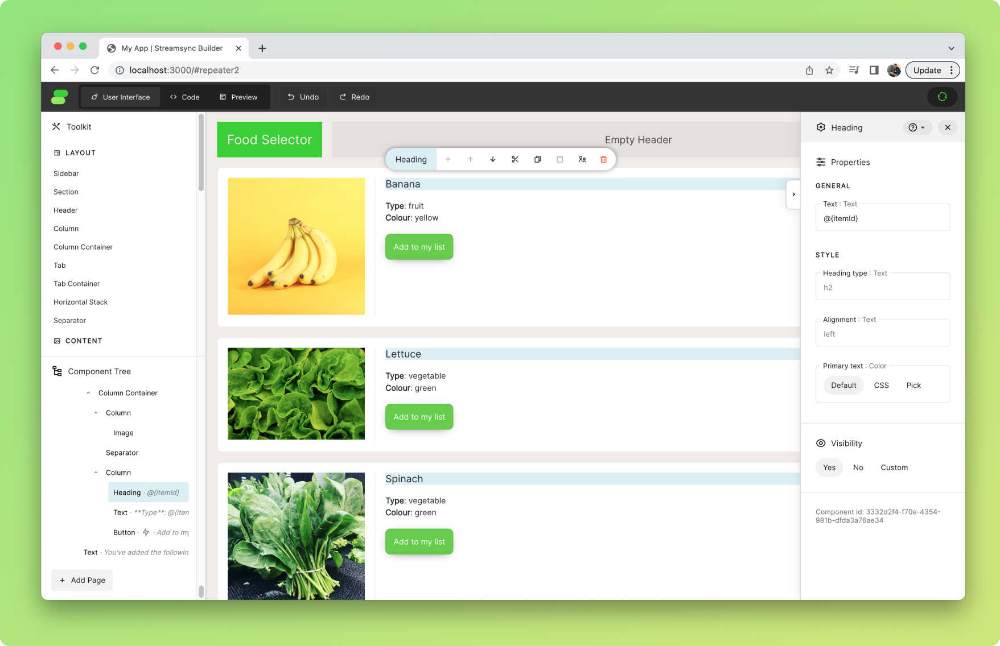

# Repeater

The _Repeater_ component allows you to repeat a group of components according to a list or dictionary.

## How it works

_Repeater_ repeats its contents for every item of a given list or dictionary. It's similar to a `for each` construct.

Each iteration is rendered with a different **context**, a dictionary containing the key and value for the relevant item. By default, in the variables `itemId` and `item`.

### Food Selector example



Given the state below, the contents of _Repeater_ will be repeated 3 times. For the first iteration, `itemId` will equal `Banana`, and `item` will equal `{"type": "fruit", "colour": "yellow"}`. Components inside _Repeater_ will be able to access this data using references such as `@{itemId}` and `@{item.type}`.

```py
ss.init_state({
    "articles": {
        "Banana": {
            "type": "fruit",
            "colour": "yellow"
        },
        "Lettuce": {
            "type": "vegetable",
            "colour": "green"
        },
        "Spinach": {
            "type": "vegetable",
            "colour": "green"
        }
    },
    "order_list": []
})
```

## Event context

When working with _Repeater_ components, you can get the context data using the `context` argument in the event handler.

Continuing with the Food Selector example above, the following handler can be linked to a _Button_ —allowing users to add items to a list.

```py
# The event handler below adds the itemId
# of the relevant article to the order list
def handle_add_to_list(state, context):
    state["order_list"] += [context["itemId"]]
```

::: warning Binding to context isn't possible
Although context can be consumed similarly to state, using the `@{my_element}` syntax, only state can be used for two-way binding. If writing data from context is needed, use an event handler like the one shown above.
:::