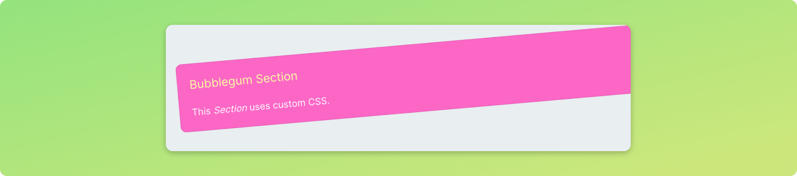

# Stylesheets

The appearance of your application can be fully customised via CSS stylesheets. These are dynamically linked during runtime and can be switched from the backend, targeting all or specific sessions.

## Importing a stylesheet

Stylesheet imports are triggered via Streamsync's `mail`, similarly to other features discussed in [Backend-initiated actions](/backend-initiated-actions). When the import is triggered, the frontend downloads the specified stylesheet and creates a `style` element with its contents.

The `import_stylesheet` method takes the `stylesheet_key` and `path` arguments. The first works as an identifier that will let you override the stylesheet later if needed. The second is the path to the CSS file.The path specified needs to be available to the frontend, so storing it in the `/static` folder of your app is recommended.

The following code imports a stylesheet when handling an event.

```py
def handle_click(state):
    state.import_stylesheet("theme", "/static/custom.css")
```

In many cases, you'll want to import a stylesheet during initialisation time, for all users. This is easily achievable via the initial state, as shown below.

```py
initial_state = ss.init_state({
    "counter": 1
})

initial_state.import_stylesheet("theme", "/static/custom.css")
```

::: tip Use versions to avoid caching
During development time, stylesheets may be cached by your browser, preventing updates from being reflected. Append a querystring to bust the cache, e.g. use `/static/custom.css?3`. 
:::


## Applying CSS classes

You can use the property *Custom CSS classes* in Builder's *Component Settings* to apply classes to a component, separated by spaces. Internally, this will apply the classes to the root HTML element of the rendered component.


## Tips for effective stylesheets

The CSS code for the class used earlier, `bubblegum`, can be found below. Note how the `!important` flag is used when targetting style attributes that are configurable via Builder. If the flag isn't included, these declarations will not work, because built-in Streamsync styling is of higher specificity. 

```css
.bubblegum {
    background: #ff63ca !important;
    line-height: 1.5;
    transform: rotate(-5deg);
}

/* Targeting an element inside the component root element */
.bubblegum > h2 {
    color: #f9ff94 !important;
}
```

::: warning Component structure may change
When targeting specific HTML elements inside components, take into account that the internal structure of components may change across Streamsync versions.
:::

Alternatively, you can override Streamsync's style variables. This behaves slightly differently though; style variables are inherited by children components. For example, if a *Section* has been assigned the `bubblegum` class, its children will also have a pink background by default.

```css
.bubblegum {
    --containerBackgroundColor: #ff63ca;
    --primaryTextColor: #f9ff94;
    line-height: 1.5;	
    transform: rotate(-5deg);
}
```

The class can be used in *Component Settings*. If the stylesheet is imported, the effect will be immediate. In case the stylesheet has been modified since imported, it'll need to be imported again.



## Targeting component types

Streamsync components have root HTML elements with a class linked to their type. For example, *Dataframe* components use the class *CoreDataframe*. When writing a stylesheet, you can target all *Dataframe* components as shown below.

```css
.CoreDataframe {
    line-height: 2.0;
}
```

## Implementing themes

It's possible to switch stylesheets during runtime, by specifying the same `stylesheet_key` in subsequent calls. This allows you to implement a "theme" logic if desired, targeting the whole or a specific part of your app. 

```py
def handle_cyberpunk(state):
    state.import_stylesheet("theme", "/static/cyberpunk_theme.css")

def handle_minimalist(state):
    state.import_stylesheet("theme", "/static/minimalist_theme.css")
```
