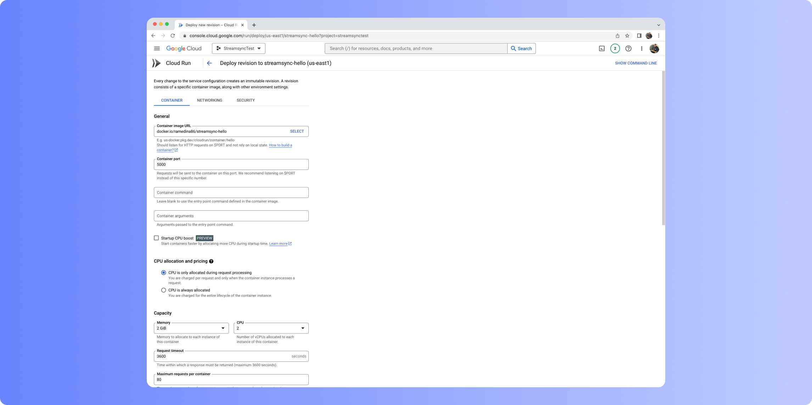

You can use Docker to deploy Framework anywhere. If you're an experienced Docker user, you may want to go straight to the provided Dockerfile.

## Creating a Docker image

### Setting up

- Make sure you have Docker installed.
- Open a terminal and navigate to your app's folder.
- Create a `pyproject.toml` using `poetry init` and install `writer` using `poetry add writer`

### Creating a Dockerfile

A Dockerfile is a file with instructions that tell Docker how to build your image. It must be named `Dockerfile`.

You can use the following as-is, or as a starting point. It should be saved in your app's folder, together with `main.py` and `ui.json`.

```docker
FROM python:3.10-bullseye
RUN apt-get update -y && mkdir /app
RUN apt-get install build-essential cmake python3-dev -y
COPY . /app
WORKDIR /app
RUN pip3 install poetry
RUN poetry config virtualenvs.create false
RUN poetry install --only main
ENTRYPOINT [ "writer", "run" ]
EXPOSE 8080
CMD [ ".",  "--port", "8080", "--host", "0.0.0.0" ] 
```

<Note> 
This Dockerfile is just a guideline.
It uses an official Python slim base image with a multistage build to reduce the size of the built image.
If you're a Docker expert, feel free to work on your own `Dockerfile`. Framework is, after all, a standard Python package.
</Note>

### Building the Docker image

To build the image, write `docker build . -t ` followed by an image tag, which you're free to choose and will locally identify your image.

```sh
docker build . -t my_streamsync_app
```

<Warning> 
Platform considerations

By default, Docker builds images in the architecture it's being run on. If you're working with an ARM computer, such as a Mac M2 or a Raspberry Pi, Docker will build an ARM image. Most cloud services will only accept x86 images. You can use another computer (or virtual machine) to build the image, or you can use [Docker buildx](https://docs.docker.com/build/building/multi-platform/).
</Warning>

## Publishing your Docker image

Once your Docker image has been built, you can publish it to a registry. This is a place where Docker images are stored and made available to other services.

We recommend using Docker Hub; it has a generous free tier, it's very easy to set up and it's widely supported. However, you can choose to use another service such as Azure Container Registry. To use Docker Hub, you'll need to sign up for an account.

You can push your image using the following commands.

```sh
# Login to Docker Hub
docker login

# Push the image
# Replace "my_streamsync_app" for the tag you've previously chosen
# Replace "my_user" for your user on Docker Hub
docker tag my_streamsync_app:latest my_user/my_streamsync_app:latest
docker push my_user/my_streamsync_app:latest
```

If your image is public, anyone can now run the following command and start the app. It's important to bind the port to a port in the host machine. The command below binds port 8080 in the Docker image to port 8080 in the host.

```sh
docker run -p 8080:8080 my_user/my_streamsync_app
```

Go on your browser to [http://localhost:8080](http://localhost:8080) to check everything is working as expected.

## Deploying your Docker image

As mentioned earlier, once the image is a registry, it can be spun up by others. After trying a few options, we recommend using Google Cloud Run. Its free tier is generous and SSL works out of the box.



Cloud Run can be configured in just one page. It takes the image from a registry and makes it available via a URL, with SSL enabled by default. We recommend the following settings:

- Minimum 0 instances, maximum 4 instances. Unless your app needs to serve several thousands of users.
- Request timeout to the maximum allowed and _Session Affinity_ enabled. This ensures that WebSockets connections are not unnecessarily dropped.
- 2GB of memory and 2 vCPUs. This will likely be enough to comfortably run a simple app. You can probably get away with much less (512MB of memory and 1vCPU), if your app isn't too demanding and you don't expect much traffic.

